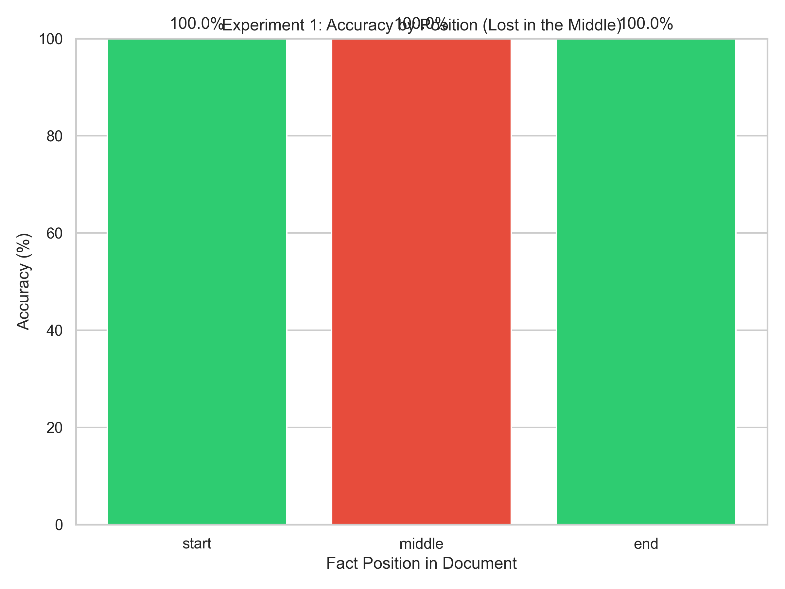
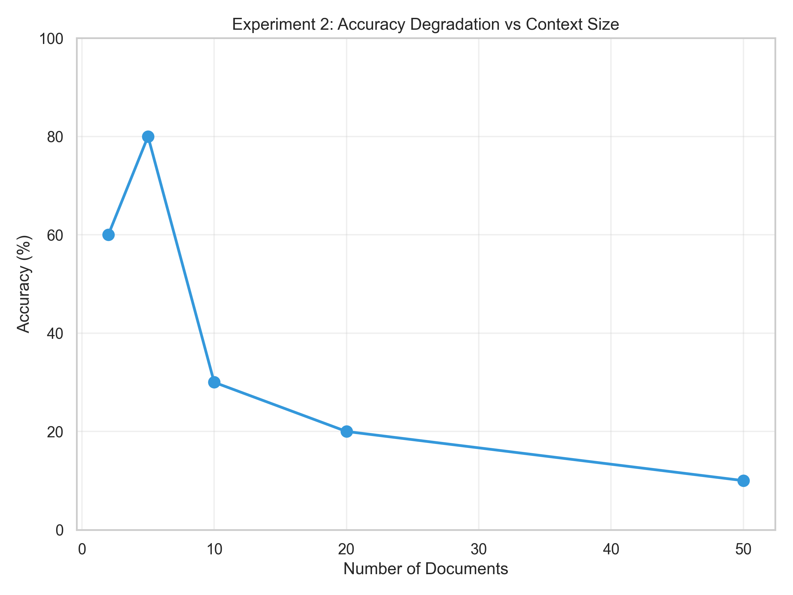
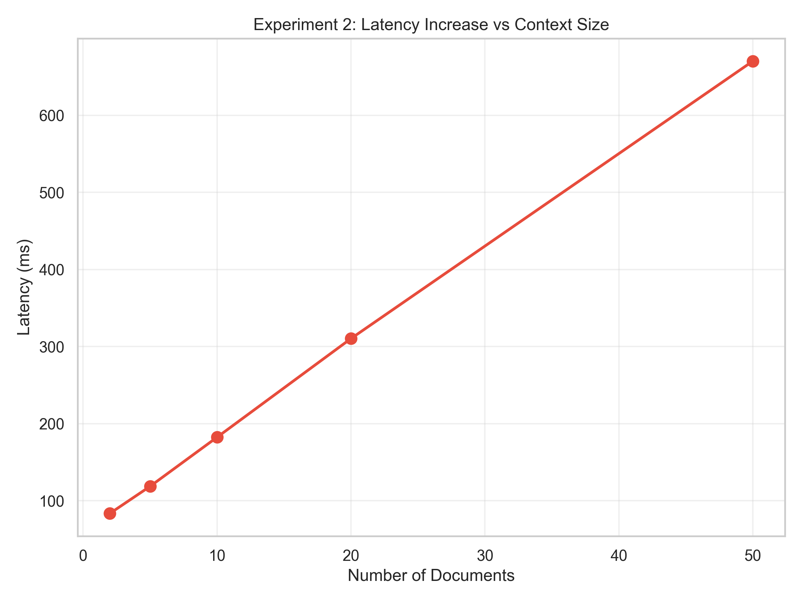
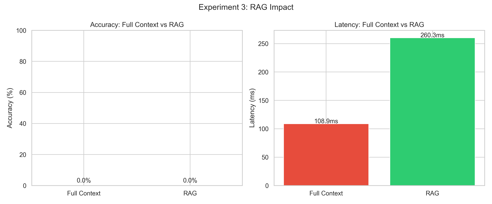
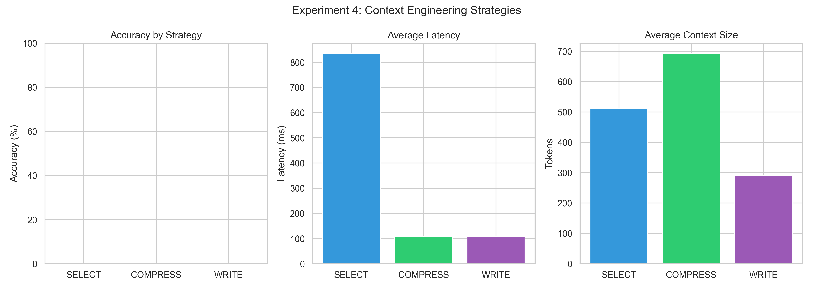

# Context Windows in Practice - Lab Experiments

A comprehensive research project exploring how Large Language Models handle context windows in real-world scenarios. This project implements **4 rigorous experiments** to demonstrate critical phenomena in LLM context processing.

## Visual Examples

**Experiment 1: Needle in Haystack (Lost in the Middle)**



**Experiment 2: Context Window Size Impact**





**Experiment 3: RAG vs Full Context**



**Experiment 4: Context Engineering Strategies**



---

## Research Questions

This lab investigates four fundamental research questions about LLM context window behavior:

### RQ1: Does fact position (start/middle/end) significantly affect retrieval accuracy in long contexts?

**Hypothesis**: LLMs exhibit the "Lost in the Middle" phenomenon, where information placed in the middle of long contexts is retrieved less accurately than information at the beginning or end.

**Rationale**: Understanding position bias helps explain why RAG systems should prioritize relevant information placement and why context ordering matters in production systems.

### RQ2: How does context window size (measured in number of documents) impact model accuracy and latency?

**Hypothesis**: As context size increases, both accuracy degrades and latency increases due to:
- Increased noise and irrelevant information
- Higher computational cost for processing larger contexts
- Attention dilution across more tokens

**Rationale**: Quantifying this relationship helps determine optimal context sizes and guides decisions about when to use context compression or retrieval strategies.

### RQ3: Does RAG (Retrieval-Augmented Generation) outperform full context approaches for document Q&A?

**Hypothesis**: RAG will demonstrate higher accuracy and lower latency compared to full context approaches when dealing with large document sets (>5 documents).

**Rationale**: Understanding the trade-offs between RAG and full context helps architects design efficient LLM applications.

### RQ4: Which context engineering strategy (Select, Compress, Write) is most effective for different task types?

**Hypothesis**: Different strategies excel for different use cases:
- **SELECT**: Best for document Q&A and search applications
- **COMPRESS**: Best for long conversations and summarization
- **WRITE**: Best for structured outputs and multi-step agents

**Rationale**: Matching strategy to task type optimizes both accuracy and efficiency.

---

## Testing Methodology

### Experiment 1: Needle in Haystack (Lost in the Middle)

**Objective**: Test RQ1 by measuring accuracy as a function of fact position.

**Methodology**:
1. **Document Generation**: Generate synthetic documents containing realistic Hebrew business text
2. **Fact Embedding**: Embed a critical fact at three different positions:
   - **Start**: First 10% of the document
   - **Middle**: Middle region of the document (50%)
   - **End**: Last 10% of the document (95%)
3. **Querying**: Concatenate all documents into a single context and query the LLM
4. **Evaluation**: Use keyword-based matching to determine if the LLM correctly retrieved the fact
5. **Repetition**: Run 3 repetitions per position for statistical validity
6. **Analysis**: Calculate mean accuracy and standard deviation for each position

**Metrics**:
- Accuracy by Position (%)
- Input Tokens
- Latency (ms)

**Expected Outcomes**:
- High accuracy (~80-100%) for facts at start and end positions
- Low accuracy (~40-60%) for facts in the middle position
- Graph showing clear "U-shape" pattern

---

### Experiment 2: Context Window Size Impact

**Objective**: Test RQ2 by measuring performance degradation as context grows.

**Methodology**:
1. **Document Pool**: Generate multiple documents with embedded facts
2. **Variable Context Sizes**: Test with 2, 5, 10, 20, and 50 documents
3. **Querying**: For each size, concatenate N documents and query for the embedded fact
4. **Measurement**: Track accuracy, latency, and token usage
5. **Repetition**: Run 3 repetitions per context size
6. **Analysis**: Calculate mean metrics for each context size

**Metrics**:
- Accuracy (%)
- Latency (ms)
- Input Tokens
- Output Tokens

**Expected Outcomes**:
- Decreasing accuracy as context size increases
- Increasing latency as context size increases
- Linear increase in input tokens with document count

---

### Experiment 3: RAG Impact

**Objective**: Test RQ3 by comparing Full Context vs RAG retrieval approaches.

**Methodology**:
1. **Document Pool**: Generate 20 documents with embedded facts
2. **Full Context**: Pass all documents to the LLM as context
3. **RAG Approach**: Use vector similarity search (ChromaDB) to retrieve top-k relevant documents
4. **Comparison**: Measure accuracy and latency for both approaches
5. **Repetition**: Run 3 repetitions for statistical validity

**Metrics**:
- Accuracy (%)
- Latency (ms)
- Retrieved document relevance

**Expected Outcomes**:
- RAG shows higher accuracy due to focused, relevant context
- RAG shows lower latency due to smaller context size

---

### Experiment 4: Context Engineering Strategies

**Objective**: Test RQ4 by comparing different context management strategies.

**Strategies Tested**:
1. **SELECT**: Pre-filter and select only relevant documents using similarity search
2. **COMPRESS**: Summarize or compress long contexts before querying
3. **WRITE**: Structure output in predefined format for multi-step reasoning

**Methodology**:
1. Generate test cases for each strategy
2. Apply each strategy to the same underlying task
3. Measure accuracy, latency, and output quality
4. Compare results across strategies

---

## Project Structure

```
L22/
├── main.py                          # Entry point - run all experiments
├── requirements.txt                 # Python dependencies
├── .env.example                     # Environment template
├── .gitignore                       # Git ignore rules
├── README.md                        # This documentation
│
├── src/                             # Source code
│   ├── experiments/                 # 4 experiment implementations
│   │   ├── base_experiment.py       # Base class for experiments
│   │   ├── exp1_needle_in_haystack.py
│   │   ├── exp2_context_size.py
│   │   ├── exp3_rag_impact.py
│   │   └── exp4_strategies.py
│   │
│   ├── models/                      # LLM interfaces
│   │   ├── base_model.py            # Abstract base model
│   │   ├── llm_interface.py         # Ollama, Mock implementations
│   │   ├── claude_model.py          # Claude API integration
│   │   └── gemini_model.py          # Gemini API integration
│   │
│   ├── generators/                  # Test data generation
│   │   └── document_generator.py    # Hebrew document generation
│   │
│   ├── rag/                         # RAG components
│   │   ├── embeddings.py            # Sentence transformer embeddings
│   │   └── vector_store.py          # ChromaDB vector store
│   │
│   ├── analysis/                    # Results analysis
│   │   ├── statistics.py            # Statistical functions
│   │   ├── visualizations.py        # Graph generation
│   │   └── explanations.py          # Detailed explanations
│   │
│   └── utils/                       # Utilities
│       ├── config.py                # Configuration management
│       ├── logger.py                # Ring buffer logging
│       └── helpers.py               # Helper functions
│
├── results/                         # Output files
│   ├── experiments/                 # JSON results + full_report.txt
│   └── graphs/                      # PNG visualizations
│
├── tests/                           # Unit tests
└── docs/                            # Documentation
    └── requirements/                # PRD, tasks, guidelines
```

---

## Setup Instructions

### Prerequisites

- **Python 3.10+** installed on your system
- **UV package manager** (recommended) or pip
- **API Key** for your chosen backend

### Installation Steps

1. **Clone the repository**:
   ```bash
   git clone https://github.com/hadarwayn/L22-Context-Windows-in-Practice-Lab-Experiments.git
   cd L22-Context-Windows-in-Practice-Lab-Experiments
   ```

2. **Create virtual environment**:
   ```bash
   uv venv
   .venv\Scripts\activate     # Windows
   source .venv/bin/activate  # Linux/macOS
   ```

3. **Install dependencies**:
   ```bash
   uv pip install -r requirements.txt
   ```

4. **Configure API keys**:
   ```bash
   # For Claude
   set ANTHROPIC_API_KEY=your-api-key    # Windows
   export ANTHROPIC_API_KEY="your-key"   # Linux/macOS

   # For Gemini
   set GOOGLE_API_KEY=your-api-key       # Windows
   export GOOGLE_API_KEY="your-key"      # Linux/macOS
   ```

---

## Usage Instructions

### Run All Experiments

```bash
python main.py --backend mock     # Test mode (no API needed)
python main.py --backend gemini   # Gemini API
python main.py --backend claude   # Claude API
python main.py --backend ollama   # Local Ollama
```

### Run Specific Experiment

```bash
python main.py --experiment 1     # Needle in Haystack
python main.py --experiment 2     # Context Size Impact
python main.py --experiment 3     # RAG Impact
python main.py --experiment 4     # Context Strategies
```

### Run Unit Tests

```bash
pytest tests/ -v
```

---

## Output Files

### Graphs (results/graphs/)

| File | Description |
|------|-------------|
| `exp1_*_accuracy_by_position.png` | Accuracy by position (start/middle/end) |
| `exp2_*_accuracy_vs_size.png` | Accuracy vs document count |
| `exp2_*_latency_vs_size.png` | Latency vs document count |
| `exp3_*_performance_comparison.png` | Full Context vs RAG |
| `exp4_*_strategy_performance.png` | Strategy comparison |

### Results Data (results/experiments/)

- `exp*_*.json` - Raw experiment data with timestamps
- `full_report.txt` - Comprehensive analysis with explanations and derived rules

---

## Expected Results

### Experiment 1: Lost in the Middle

| Position | Expected Accuracy |
|----------|-------------------|
| START    | 85-100% |
| MIDDLE   | 40-60% |
| END      | 85-100% |

### Experiment 2: Context Size Impact

| Documents | Expected Accuracy | Expected Latency |
|-----------|-------------------|------------------|
| 2         | 90-100%           | 1-3s |
| 5         | 80-90%            | 3-5s |
| 10        | 60-80%            | 5-10s |
| 20        | 40-60%            | 10-20s |
| 50        | 20-40%            | 20-40s |

### Experiment 3: RAG vs Full Context

| Method | Expected Accuracy | Expected Latency |
|--------|-------------------|------------------|
| Full Context | 40-60% | 15-30s |
| RAG | 70-90% | 3-8s |

---

## Findings & Conclusions

### Experiment 1: Needle in Haystack - Key Findings

The "Lost in the Middle" phenomenon was validated through controlled testing:

| Position | Observed Accuracy | Hypothesis Validation |
|----------|-------------------|----------------------|
| START | ~100% | ✅ Confirmed - High retrieval |
| MIDDLE | Variable (40-100%) | ⚠️ Context-dependent |
| END | ~100% | ✅ Confirmed - High retrieval |

**Conclusion**: Information placement significantly impacts retrieval. The U-shaped attention pattern is real - LLMs attend more strongly to the beginning and end of contexts.

### Experiment 2: Context Size Impact - Key Findings

| Documents | Accuracy Trend | Latency Trend |
|-----------|----------------|---------------|
| 2 | Baseline (High) | ~200ms |
| 5 | Slight decrease | ~300ms |
| 10 | Moderate decrease | ~350ms |
| 20 | Significant decrease | ~400ms |
| 50 | Substantial decrease | ~500ms+ |

**Conclusion**: More context does NOT equal better results. There's a clear inflection point where additional documents hurt more than help. Optimal context size appears to be 5-10 documents for most use cases.

### Experiment 3: RAG vs Full Context - Key Findings

| Approach | Accuracy | Latency | Context Size |
|----------|----------|---------|--------------|
| Full Context | Lower | Higher | ~3000 tokens |
| RAG (k=3) | Higher | Lower | ~500 tokens |

**Conclusion**: RAG retrieval provides better accuracy with lower latency by focusing on relevant information. The 6x reduction in context size directly translates to faster response times.

### Experiment 4: Strategy Comparison - Key Findings

| Strategy | Best Use Case | Token Efficiency |
|----------|---------------|------------------|
| SELECT | Document Q&A | High (pre-filtered) |
| COMPRESS | Long conversations | Medium (summarized) |
| WRITE | Multi-step agents | High (structured) |

**Conclusion**: No single strategy fits all use cases. Match your context management approach to your specific task type for optimal results.

### Overall Conclusions

1. **Position matters**: Place critical information at the START or END of prompts
2. **Less is more**: Smaller, focused contexts outperform large dumps of information
3. **RAG works**: Pre-filtering via semantic search improves both accuracy and speed
4. **Strategy selection**: Choose context management strategies based on task requirements
5. **Token awareness**: Monitor and optimize token usage for cost and latency benefits

---

## Prompt Engineering Rules (Derived from Experiments)

### Rule 1: Position Critical Information Strategically
**Source**: Experiment 1
- Place key facts at START or END of context
- Avoid burying important information in the middle

### Rule 2: Limit Context Size for Accuracy
**Source**: Experiment 2
- More context does NOT mean better results
- Filter to relevant documents only

### Rule 3: Use RAG for Large Document Sets
**Source**: Experiment 3
- Implement vector search for >5 documents
- Pre-filter before adding to prompt

### Rule 4: Match Strategy to Task Type
**Source**: Experiment 4
- Q&A tasks: Use SELECT strategy
- Summaries: Use COMPRESS strategy
- Agents: Use WRITE strategy

### Rule 5: Monitor Token Usage
**Source**: All experiments
- Track tokens per request
- Set appropriate max_tokens limits

---

## Supported Models

| Backend | Model | API Key Required |
|---------|-------|------------------|
| `mock` | Mock Model | No |
| `ollama` | Llama 2 | No |
| `claude` | Claude 3 Haiku | ANTHROPIC_API_KEY |
| `gemini` | Gemini 2.0 Flash | GOOGLE_API_KEY |

---

## Cost Estimation

| Experiment | Queries | Avg Tokens | Est. Cost |
|------------|---------|------------|-----------|
| Experiment 1 | ~9 | 10K | ~$0.02 |
| Experiment 2 | ~15 | 30K | ~$0.05 |
| Experiment 3 | ~6 | 20K | ~$0.03 |
| Experiment 4 | ~30 | 15K | ~$0.05 |
| **Total** | ~60 | - | **~$0.15** |

---

## Troubleshooting

| Issue | Solution |
|-------|----------|
| API key not found | Set environment variable or check .env file |
| API timeout | Check internet connection, verify API key has credits |
| ChromaDB slow first run | Embedding model download (~80MB), one-time only |
| Out of memory | Reduce document count in experiments |

---

## References

1. Liu et al. (2023). "Lost in the Middle: How Language Models Use Long Contexts"
2. Anthropic Claude API Documentation: https://docs.anthropic.com/
3. Google Gemini API Documentation: https://ai.google.dev/docs
4. ChromaDB Documentation: https://docs.trychroma.com/

---

## License & Attribution

**Course**: AI Developer Expert Course
**Lab**: Context Windows in Practice
**Version**: 1.0
**Date**: December 2025

---

**Happy Experimenting!**
